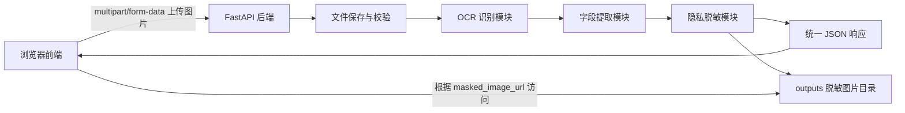

# 项目整体设计

## 1. 项目定位

项目名称暂定为：

**基于 OCR 的快递面单信息识别与隐私保护系统**

系统围绕快递面单图片，完成从图片上传、文字识别、字段抽取到隐私保护展示的完整流程。项目不以训练 OCR 模型为主要目标，而是以 OCR 应用链路、字段结构化、隐私脱敏和前后端完整演示为重点。

## 2. 建设目标

### 2.1 基础目标

- 支持用户上传快递面单图片。
- 前端能够预览用户上传的原图。
- 后端能够接收并保存图片。
- 后端能够返回 OCR 文本结果。
- 后端能够抽取收件人、手机号、地址、快递单号。
- 系统能够对手机号等隐私字段做结构化脱敏。
- 系统能够生成脱敏后的图片。
- 前端能够展示结构化字段、完整 OCR 文本和脱敏图片。

### 2.2 答辩展示目标

答辩时需要完整演示以下链路：

```text
选择快递面单图片
  -> 前端预览图片
  -> 点击开始识别
  -> 后端接收图片
  -> OCR 识别文字
  -> 字段提取
  -> 隐私脱敏
  -> 前端展示识别结果和脱敏图片
```

### 2.3 非目标

当前版本不做以下内容：

- 用户登录和权限管理。
- 数据库持久化。
- 云端部署。
- 多人协同后台。
- OCR 模型训练。
- 复杂版式理解模型。
- 复杂任务队列。

这些功能会增加开发成本，不适合两天内完成的生产实习大作业。

## 3. 总体架构



## 4. 模块职责

### 4.1 前端模块

前端使用原生 HTML、CSS、JavaScript 实现单页应用，主要职责：

- 选择图片文件。
- 校验是否已选择文件。
- 展示原图预览。
- 调用后端识别接口。
- 展示识别状态。
- 展示结构化字段。
- 展示 OCR 完整文本。
- 展示脱敏图片。
- 处理接口错误提示。

页面状态至少包括：

- 未选择图片。
- 已选择图片。
- 正在识别。
- 识别成功。
- 识别失败。

### 4.2 后端入口模块

`backend/main.py` 负责：

- 创建 FastAPI 应用。
- 开启 CORS。
- 注册接口路由。
- 挂载 `outputs/` 静态目录。
- 提供 `/api/health` 和 `/api/recognize`。

### 4.3 响应结构模块

`backend/schemas.py` 负责定义统一响应结构：

- 成功响应。
- 失败响应。
- OCR 文本项。
- 识别结果数据。

核心原则：所有接口都返回统一格式，避免前端适配混乱。

### 4.4 文件处理模块

`backend/file_utils.py` 负责：

- 校验上传文件类型。
- 生成唯一文件名。
- 保存上传图片到 `uploads/`。
- 生成输出图片路径。
- 限制图片大小。

建议支持格式：

- jpg
- jpeg
- png
- bmp
- webp，可选

### 4.5 OCR 模块

`backend/ocr_service.py` 负责：

- 第一阶段返回 mock OCR 结果。
- 第二阶段接入 PaddleOCR。
- 统一输出 OCR 结果格式。

统一 OCR 输出格式：

```json
[
  {
    "text": "收件人：张三",
    "confidence": 0.98,
    "box": [[50, 80], [220, 80], [220, 115], [50, 115]]
  }
]
```

### 4.6 字段提取模块

`backend/extractor.py` 负责：

- 将 OCR 文本合并。
- 使用关键词和正则表达式抽取字段。
- 输出结构化字段。
- 对未识别字段返回 null，而不是直接让整个请求失败。

需要抽取的字段：

- 收件人姓名：`receiver_name`
- 手机号：`raw_phone`
- 脱敏手机号：`phone`
- 地址：`address`
- 快递单号：`tracking_number`

### 4.7 隐私脱敏模块

`backend/masker.py` 负责：

- 对手机号进行字符串脱敏，例如 `13812345678` -> `138****5678`。
- 根据 OCR 文本判断哪些 box 属于敏感区域。
- 在图片上对敏感区域进行遮挡或马赛克处理。
- 将脱敏图片保存到 `outputs/`。

第一版可以使用黑色矩形遮挡；第二版可以改成马赛克。

### 4.8 业务编排模块

`backend/services.py` 负责串联完整流程：

```python
def recognize_waybill(image_path):
    ocr_results = run_ocr(image_path)
    fields = extract_fields(ocr_results)
    masked_path = mask_sensitive_info(image_path, ocr_results, fields)

    return {
        "fields": fields,
        "ocr_results": ocr_results,
        "masked_path": masked_path
    }
```

该模块只负责流程编排，不写具体 OCR、正则、图片处理细节。

## 5. 运行流程

### 5.1 MVP 阶段流程

MVP 阶段先不接真实 OCR：

```text
用户上传图片
  -> 保存图片
  -> mock OCR 返回固定文本和固定 box
  -> 正则提取字段
  -> Pillow 复制原图并遮挡固定敏感区域
  -> 返回 JSON
  -> 前端展示
```

### 5.2 真实 OCR 阶段流程

接入 PaddleOCR 后：

```text
用户上传图片
  -> 保存图片
  -> PaddleOCR 识别文本、置信度和文本框
  -> 统一转换成系统 OCR 结果格式
  -> 正则提取字段
  -> 根据敏感文本所在 box 对图片打码
  -> 返回 JSON
  -> 前端展示
```

## 6. 页面设计

页面采用单页布局：

```text
-------------------------------------------------
| 基于 OCR 的快递面单信息识别与隐私保护系统        |
-------------------------------------------------
| 上传与原图预览             | 识别结果            |
| [选择图片]                 | 收件人              |
| 原图区域                   | 手机号              |
| [开始识别]                 | 地址                |
|                            | 快递单号            |
-------------------------------------------------
| OCR 完整文本                                    |
-------------------------------------------------
| 脱敏图片预览                                    |
-------------------------------------------------
```

前端不需要做复杂路由，也不需要引入 Vue 或 React。

## 7. MVP 验收标准

只要满足以下条件，就认为第一版可用于演示：

- 后端服务可以启动。
- `/api/health` 返回正常。
- 前端可以选择图片并显示预览。
- 点击识别后可以调用 `/api/recognize`。
- 接口返回统一 JSON。
- 页面能展示收件人、手机号、地址、快递单号。
- 页面能展示 OCR 文本列表。
- 页面能展示后端生成的脱敏图片。
- 识别失败时页面有错误提示。

## 8. 风险与对策

| 风险 | 表现 | 对策 |
| --- | --- | --- |
| PaddleOCR 环境安装慢 | 影响开发进度 | 先使用 mock OCR 跑通闭环 |
| 真实快递面单难获取 | 数据不足 | 使用脚本生成虚拟面单 |
| OCR 识别结果不稳定 | 字段抽取失败 | 模板中固定关键词，正则做兜底 |
| 前后端格式不一致 | 联调困难 | 先固定接口 JSON 格式 |
| 图片打码定位不准 | 脱敏效果差 | 先用固定 box，后换 OCR box |
